# Social Media App


A full-stack Flutter social media app — not just the UI layer. Built end-to-end with **Clean Architecture** and **BLoC**, backed by **Supabase** (Auth, Postgres, Storage, Realtime). Features include an infinite-scroll feed, real-time like syncing across devices, Google OAuth, profile management, and offline-first caching.

## 📱 Screenshots

### Dark Mode

| Feed | Profile | Login |
|:---:|:---:|:---:|
| 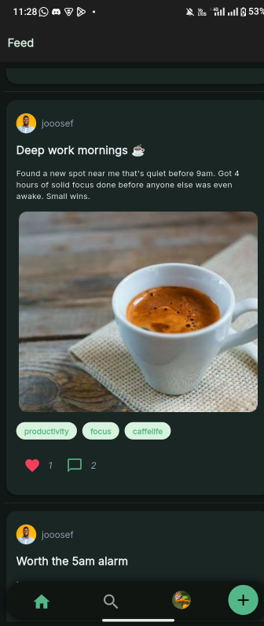 | 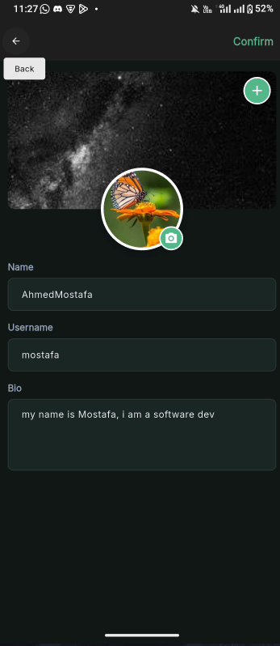 | 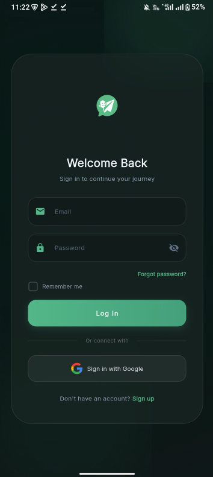 |

| Discover | Comments | Followers |
|:---:|:---:|:---:|
| 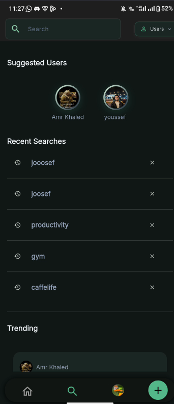 | 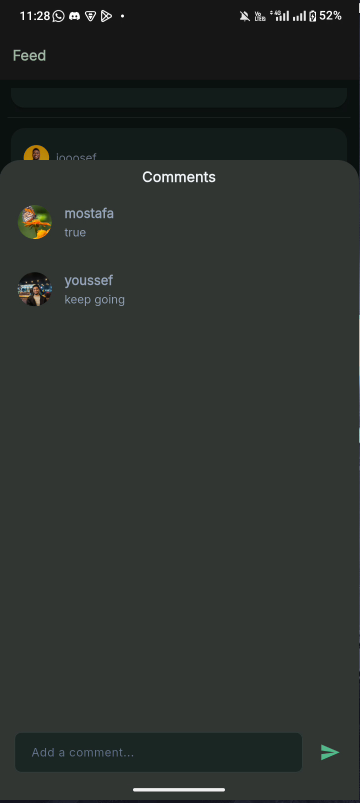 | 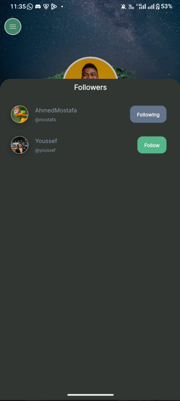 |

### Light Mode

| Feed | Profile | Login |
|:---:|:---:|:---:|
| 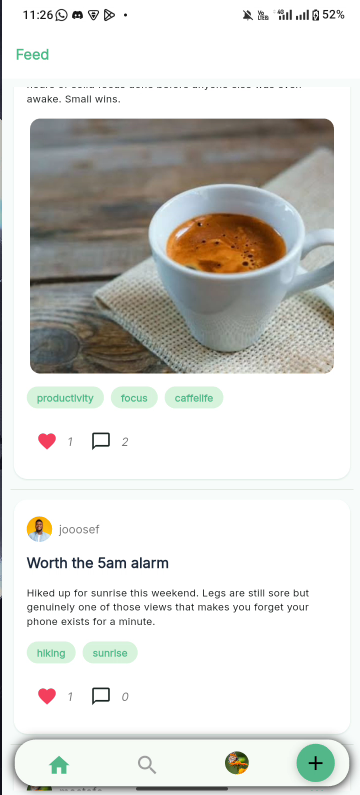 | 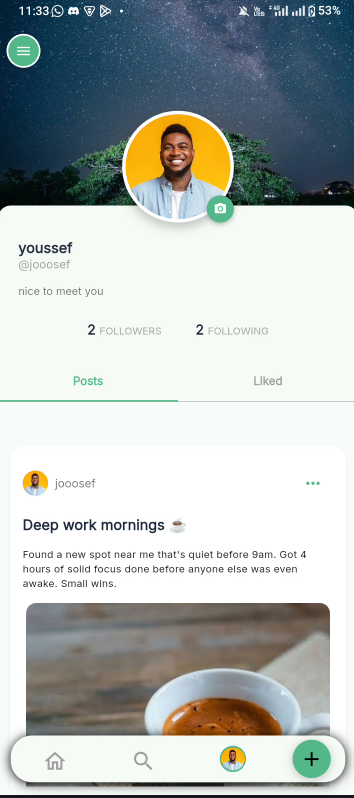 | 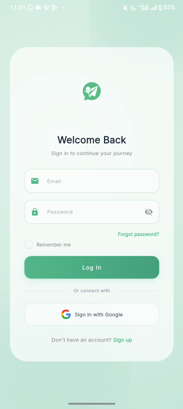 |

| Followers | Drawer |
|:---:|:---:|
| 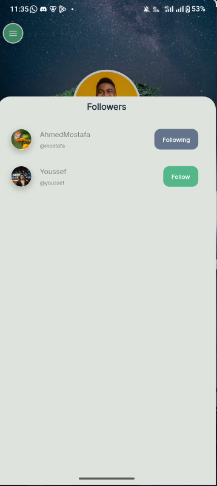 | 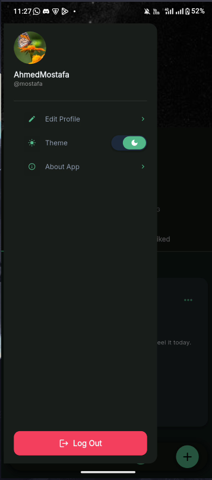 |

## ✨ Features

- **Auth** — Email/password + Google OAuth via Supabase, with session persistence across app restarts.
- **Posts Feed** — Infinite-scroll feed with local caching for offline access.
- **Post Management** — Create, edit, and delete posts with image attachments.
- **Reacts** — Like/unlike with an atomic, race-condition-safe counter and live count sync across devices.
- **Comments** — Add, edit, and swipe-to-delete comments.
- **Profile & Media** — Edit profile info and upload avatar/background images with cropping.
- **Search** — Search posts and users with history and suggestions.
- **Responsive UI** — Mobile, tablet, and desktop layouts.
- **Dark/Light Mode** — Persisted across sessions via HydratedBloc.

## 🏗️ Architecture

**Clean Architecture + BLoC** — each feature is split into `Data` / `Domain` / `Presentation` layers. `UserModel` (data) is kept separate from the `User` entity (domain/presentation) to avoid leaking serialization concerns upward.

| Concern | Implementation |
|---|---|
| **State Management** | `flutter_bloc` + `hydrated_bloc` (disk-persisted auth & theme) |
| **Dependency Injection** | `get_it`, feature-scoped registration |
| **Routing** | `go_router` with `ShellRoute` for bottom nav + auth guards |
| **Error Handling** | `dartz` `Either<Failure, T>` from repos outward — no bare try/catch in UI |
| **Offline-first** | Local caching via `shared_preferences` / `hydrated_bloc`, connectivity checks via `internet_connection_checker_plus`, Realtime for live updates |

<details>
<summary><strong>📁 Folder Structure</strong></summary>

```
lib/
├── main.dart             # Application entry point & initialization
├── app.dart              # Root widget & Theme providers
├── core/                 # Shared infrastructure
│   ├── constants/        # Constants, enums, dimensions
│   ├── di/               # Dependency injection container
│   ├── Error/            # Custom Failures & Exceptions
│   ├── network/          # Network connectivity checks
│   ├── routing/          # GoRouter setup & Auth Guards
│   ├── theming/          # Dark/Light theme & extensions
│   └── widgets/          # Reusable UI components
└── features/             # Feature-driven modules (Clean Architecture)
    ├── auth/             # Login, Signup, OAuth
    ├── Comments/         # Post comments management
    ├── Posts/            # Feed, Create/Edit/Delete post
    ├── Reacts/           # Post interactions, Realtime sync
    ├── Search/           # Search posts and users
    └── user/             # User profiles, settings, media upload
```

</details>

## 🛠️ Tech Stack

| Category | Package / Tech |
|---|---|
| **Framework** | Flutter (`>=3.10.0`) |
| **Backend** | `supabase_flutter` (Auth, Postgres, Storage, Realtime) |
| **State Management** | `flutter_bloc`, `hydrated_bloc`, `equatable` |
| **Routing** | `go_router`, `go_provider` |
| **Dependency Injection** | `get_it` |
| **Functional Prog.** | `dartz` |
| **Local Storage** | `shared_preferences`, `hydrated_bloc` |
| **Media** | `image_picker`, `image_cropper`, `cached_network_image` |
| **UI Components** | `animated_toggle_switch`, `flutter_side_menu`, `dotted_border`, `readmore`, `flutter_svg` |

## 🧩 Interesting Problems I Solved

A few bugs and decisions that taught me more than the average CRUD screen:

<details>
<summary><strong>Like counters kept desyncing under fast taps</strong></summary>

Fixed with a Postgres trigger that updates the like count atomically on insert/delete, instead of counting client-side. Counts also sync live across devices with Supabase Realtime. On the Flutter side I scoped `BlocSelector` per `postId` so liking one post doesn't rebuild the whole feed.

</details>

<details>
<summary><strong>Likes/comments were "working" but not actually saving</strong></summary>

Turns out I hadn't set up Row Level Security policies for those tables — inserts looked fine in the app's local state but never actually landed in Postgres. The bug wasn't in my Bloc logic at all, it was a missing policy on the backend.

</details>

<details>
<summary><strong>Second login crashed the app</strong></summary>

Traced it to `_streamSubscription?.cancel()` on logout killing the Google OAuth deep-link listener for good, plus a leftover `emit(AuthInitial())` in the logout handler leaving stale state around. Fixed by making cancel-and-resubscribe happen together in one `_initAuthListener()` method.

</details>

<details>
<summary><strong>Avatar/background upload edge cases</strong></summary>

Built a shared `_uploadImage` helper (folder-based separation in Supabase Storage) and made sure the Cubit uploads the image _before_ calling `updateUser`, using null-based partial updates so I'm not overwriting fields the user didn't touch.

</details>

<details>
<summary><strong>Full backend migration off a dummy JSON API</strong></summary>

Migrated the whole app onto Supabase (auth, posts, comments, users, media) including writing the RLS policies myself, while keeping the domain layer contracts the same so the presentation layer didn't need to change.

</details>

## 🚀 Getting Started

### Prerequisites

- Flutter SDK `>=3.10.0`
- Dart SDK `^3.10.0`
- A Supabase project (Auth, Postgres, Storage enabled)

### Installation

```bash
# Clone the repository
git clone https://github.com/YoussefMohamedSafwat/Social_app.git

# Install dependencies
cd Social_app
flutter pub get
```

Add your Supabase URL and anon key (e.g. via `--dart-define` or a config file).

```bash
# Run the app
flutter run
```

### Code Quality

```bash
flutter analyze    # Lint check
dart format .      # Format code
flutter test       # Run tests
```
